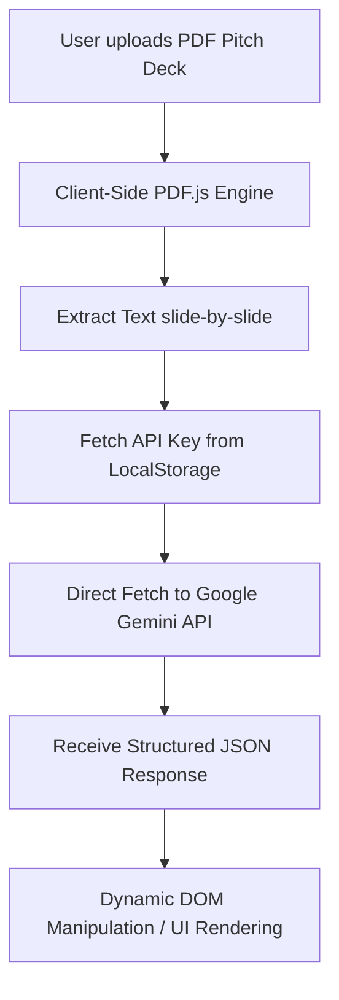

# PitchSense

# PitchSense — Developer Guide & Learning Path

This guide explains the architecture, technologies, and code logic of **PitchSense**, 

---

## 1. Project Architecture Overview

PitchSense is a **100% serverless, client-side web application**. Everything runs entirely inside the user's browser. There is no backend server, database, or cloud hosting (other than static file hosting).



### Key Advantages of this Architecture
* **Zero Cost**: Hosting is free (only static files).
* **Privacy-First**: The PDF is processed locally, and the API key never leaves the browser (no middleman database).
* **Speed**: Direct client-to-API communication removes server roundtrips.

---

## 2. Technology Stack Breakdown

| Technology | What it does in PitchSense | Key Concepts to Know |
| :--- | :--- | :--- |
| **HTML5** | Defines the page structure (Header, Steps, Cards, Loading steps, and Results). | Semantic elements (`<header>`, `<main>`, `<section>`), custom `data-*` attributes (used for option chips). |
| **CSS3 (Vanilla)** | Creates a premium, modern, editor-style UI without UI frameworks. | CSS custom variables (`:root`), Flexbox, CSS Grid, Transitions/Animations (`@keyframes pulse`), Responsive design (`@media` queries). |
| **Vanilla JavaScript** | Drives application logic, event listeners, file handling, and network requests. | `async/await`, `fetch` API, Promises, `localStorage`, JSON parsing, `try...catch` error handling. |
| **PDF.js (Mozilla)** | Extracts text directly from the PDF in the browser. | Web Workers, ArrayBuffers, PDF Document Object Model. |
| **Gemini API** | Generates the VC-grade analysis and structured audit report. | Prompt engineering, system instructions, structured output forcing (JSON mode). |

---

## 3. Deep Dive into Core Code Logic

To explain the project convincingly, you must understand how the three main features work:

### 1. Extracting PDF Text on the Client Side
Web browsers cannot natively read text inside a binary PDF file. We use **PDF.js** (Mozilla's open-source PDF reader) to do this:

```javascript
async function extractPdfText(file) {
  // Convert the uploaded File object into an ArrayBuffer (binary data)
  const arrayBuffer = await file.arrayBuffer();
  // Load the document using the PDF.js library
  const pdf = await pdfjsLib.getDocument({ data: arrayBuffer }).promise;
  
  let fullText = '';
  // Loop through all pages (1-indexed in PDF.js)
  for (let i = 1; i <= pdf.numPages; i++) {
    const page = await pdf.getPage(i);
    const content = await page.getTextContent();
    // Join text fragments from the page with spaces
    const pageText = content.items.map(item => item.str).join(' ');
    fullText += `\n--- Slide ${i} ---\n${pageText}`;
  }
  return fullText.trim();
}
```

### 2. Validating the Gemini API Key
To ensure the user entered a valid API key, we fetch the available models endpoint. If the call succeeds and returns models, we know the key works:

```javascript
async function getAvailableModels(apiKey) {
  // Request list of supported models from Google
  const res = await fetch(`https://generativelanguage.googleapis.com/v1beta/models?key=${apiKey}`);
  if (!res.ok) throw new Error("Invalid API key or network issue");
  
  const data = await res.json();
  // Filter for models that support text generation (e.g. Gemini Flash or Pro)
  return (data.models || [])
    .filter(m => m.supportedGenerationMethods.includes('generateContent'))
    .map(m => m.name);
}
```

### 3. Fetching and Forcing JSON Output from Gemini
To render the report dynamically (like drawing progress bars or separating strengths/weaknesses), we need a predictable JSON structure from Gemini, not plain markdown text.

We achieve this with two techniques:
1. **System Prompt**: We instruct Gemini to act as a VC analyst and respond **ONLY** with valid JSON (no markdown triple-backticks ` ```json `).
2. **User Prompt Template**: We supply an exact structural template showing the keys (`overall_score`, `strengths`, `suggestions`, etc.) we expect.

```javascript
const systemPrompt = `You are an expert venture capital analyst and pitch deck auditor. Always respond ONLY with valid JSON, no markdown fences, no commentary.`;
// We fetch the API directly from the browser using standard fetch:
const response = await fetch(
  `https://generativelanguage.googleapis.com/v1beta/${modelName}:generateContent?key=${apiKey}`,
  {
    method: 'POST',
    headers: { 'Content-Type': 'application/json' },
    body: JSON.stringify({
      contents: [{ parts: [{ text: userPrompt }] }],
      systemInstruction: { parts: [{ text: systemPrompt }] }
    })
  }
);
```

---

## 4. "Built from Scratch" Talking Points (Interview Guide)

If someone asks how you built this, here is how you explain your process step-by-step:

* **"I wanted to build a fast, secure tool for founders to audit their decks without uploading their proprietary pitches to third-party databases."** (This shows a product-oriented mindset and security awareness).
* **"To achieve this, I built the app completely serverless. I used Mozilla's PDF.js library to handle the heavy lifting of parsing PDF binaries on the client side, saving the overhead of a dedicated backend node."** (Shows architectural knowledge).
* **"I integrated Google's Gemini API directly through HTTP fetch requests. To ensure a smooth UX, I did two things: dynamic API key validation (checking model availability on key save) and prompt engineering to enforce strict JSON responses so my frontend could parse and render the data dynamically."** (Shows integration skill).
* **"For the styling, I chose Vanilla CSS with custom properties (variables) to maintain a cohesive design system. I avoided UI frameworks to keep the load time virtually instantaneous."** (Shows performance focus).

---

## 5. What You Should Study & Practice

To speak about this project with 100% confidence, study these topics:

### 1. JavaScript Concepts
* **Asynchronous JS**: Understand `async/await`, `fetch` API, and how `Promises` work. You should know how `await` pauses execution until the promise resolves.
* **Document Object Model (DOM)**: Understand how `document.getElementById()`, `classList.add()`, and changing `textContent` work to update the webpage on the fly.
* **Browser Storage**: Understand `localStorage` vs `sessionStorage` vs `Cookies`. Know that `localStorage` persists data even when the tab/browser is closed.

### 2. CSS Design Systems
* **CSS Variables**: Learn how to declare colors and themes inside `:root` (e.g. `--accent: #c84b2f;`) and use them with `var(--accent)`.
* **Layouts**: Master Flexbox (`display: flex; align-items: center; justify-content: space-between;`) and Grid.

### 3. API Integrations
* **REST APIs**: Understand endpoints, query parameters (e.g., `?key=YOUR_KEY`), headers, request bodies, and HTTP status codes (200 OK, 400 Bad Request, 403 Forbidden).
* **JSON (JavaScript Object Notation)**: Learn how `JSON.stringify()` (converts JS objects to text) and `JSON.parse()` (converts text to JS objects) work.
